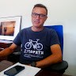

 
  jmartine@ual.es   Universidad de Almería   Almería (Spain)

# &nbsp;

## Resumen

* 30 años de experiencia como profesor Universitario
* Certificaciones Cisco Network
* Experiencia en:
  * Redes de Computadoras
  * Administración de Sistemas Operativos
  * Multiprocesamiento (MPI, Treads y CUDA)
  * Cloud Computing

## Experiencia de trabajo

#### Actualmente 

En este curso estoy impartiendo las asignaturas:
 
* Multiprocesadores del Grado en Ingeniería Informática de la Universidad de Almería
* Infraestructura Big Data del Máster en Ingeniería Informática de la Universidad de Almería

## Investigacion

Pertenezco al grupo de investigacion [TIC-146](https://sites.google.com/ual.es/hpca) Supercomputación-Algoritmos (SAL).

El grupo de investigación TIC 146 Supercomputación-Algoritmos (SAL) se creó en 1992 y se centra en el desarrollo de software y herramientas de Computación de Altas Prestaciones para abordar una amplia variedad de problemas y aplicaciones en diversos campos de la ciencia y la tecnología. Su actividad se centra principalmente en las siguientes líneas:

* Computación de Altas Prestaciones
* Optimización Global y Multiobjetivo
* Procesamiento de Imágenes
* Codificación, compresión y transmisión de imágenes y vídeo
* Protocolos de comunicación seguros para Internet

## Educacion 

* Licenciado en Informática por la Universidad de Granada (1992)
* Doctor en Informática por la Universidad de Almería (2000)
